# Active Directory File Server with NTFS Permissions on Azure

> An end-to-end Windows file server lab built on Microsoft Azure: infrastructure provisioned with **Terraform**, the Active Directory domain and NTFS permission model configured with **PowerShell**, and access control verified against real-world business rules.

This project demonstrates a problem every Windows environment has to solve — **controlling who can access which data** — and solves it the way it is done in production: domain users assigned to security groups, with NTFS permissions on the file server acting as the enforcement layer.

---

## Table of Contents

1. [What This Lab Demonstrates](#what-this-lab-demonstrates)
2. [Architecture](#architecture)
3. [The Permission Model](#the-permission-model)
4. [Technology Used](#technology-used)
5. [Repository Layout](#repository-layout)
6. [Infrastructure as Code](#infrastructure-as-code)
7. [Prerequisites](#prerequisites)
8. [How to Deploy](#how-to-deploy)
9. [How It Is Configured](#how-it-is-configured)
10. [Verification](#verification)
11. [Cost Management & Teardown](#cost-management--teardown)
12. [Troubleshooting & Lessons Learned](#troubleshooting--lessons-learned)
13. [Skills Demonstrated](#skills-demonstrated)

---

## What This Lab Demonstrates

A fictional company stores departmental files on a central server. The access rules are simple to state and surprisingly easy to get wrong:

- **Finance** staff can read and write Finance files.
- **HR** staff can read and write HR files, and can *read* Finance files for cross-department reporting — but cannot change them.
- **Sales** staff can read and write Sales files only.
- **IT** has full control everywhere.
- Nobody can touch a department's files unless their group grants it.

The lab provisions the infrastructure, builds the domain, applies the permissions, and then **proves** the rules hold by logging in as each user and testing access.

Everything that gets built lands in a single resource group, deployed entirely from code:

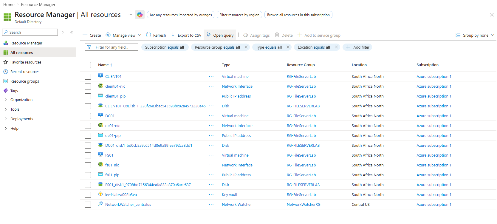
*Every component — three VMs, their NICs, public IPs, disks, and the Key Vault — provisioned by Terraform into `RG-FileServerLab`.*

---

## Architecture

Three virtual machines sit on a single subnet inside an Azure virtual network. A network security group restricts inbound RDP to a single trusted IP, and the VM administrator password is stored in Azure Key Vault rather than in any file.

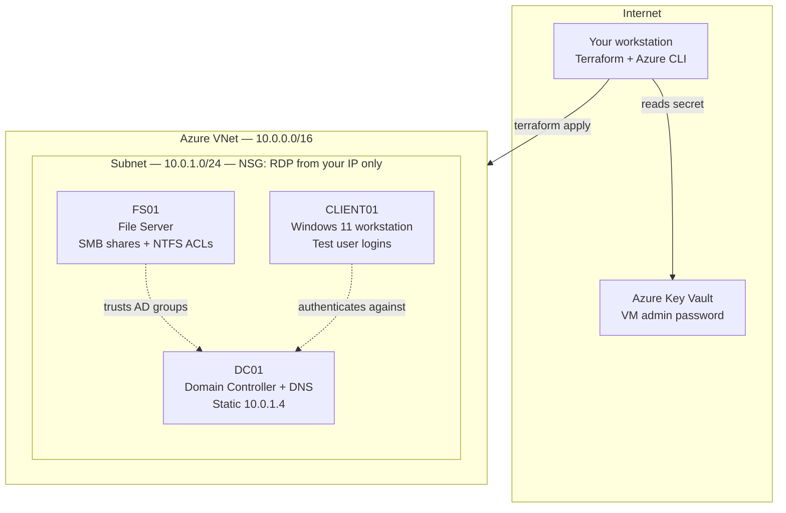
```mermaid
graph TB
    subgraph Internet
        ADMIN["Your workstation<br/>Terraform + Azure CLI"]
        KV["Azure Key Vault<br/>VM admin password"]
    end

    subgraph VNET["Azure VNet — 10.0.0.0/16"]
        subgraph SUBNET["Subnet — 10.0.1.0/24 — NSG: RDP from your IP only"]
            DC01["DC01<br/>Domain Controller + DNS<br/>Static 10.0.1.4"]
            FS01["FS01<br/>File Server<br/>SMB shares + NTFS ACLs"]
            CLIENT01["CLIENT01<br/>Windows 11 workstation<br/>Test user logins"]
        end
    end

    ADMIN -->|terraform apply| VNET
    ADMIN -->|reads secret| KV
    FS01 -.->|trusts AD groups| DC01
    CLIENT01 -.->|authenticates against| DC01
```

**Why these design choices:**

| Decision | Reason |
| --- | --- |
| DC01 has a **static** private IP (`10.0.1.4`) | FS01 and CLIENT01 point their DNS at it. If that address moved on a reboot, domain resolution would break. |
| NSG allows **RDP from one IP only** | Everything else inbound is denied by default. The servers are never exposed to the open internet. |
| Admin password lives in **Key Vault** | The Terraform variable is marked sensitive with no default and is injected at runtime — it never appears in a file or in source control. |
| Configuration uses **`az vm run-command`** | The firewall blocks WinRM. `run-command` pushes scripts through the Azure VM agent, so automation works without opening any extra port. |

The three VMs, right-sized to fit a constrained core quota, running in South Africa North:

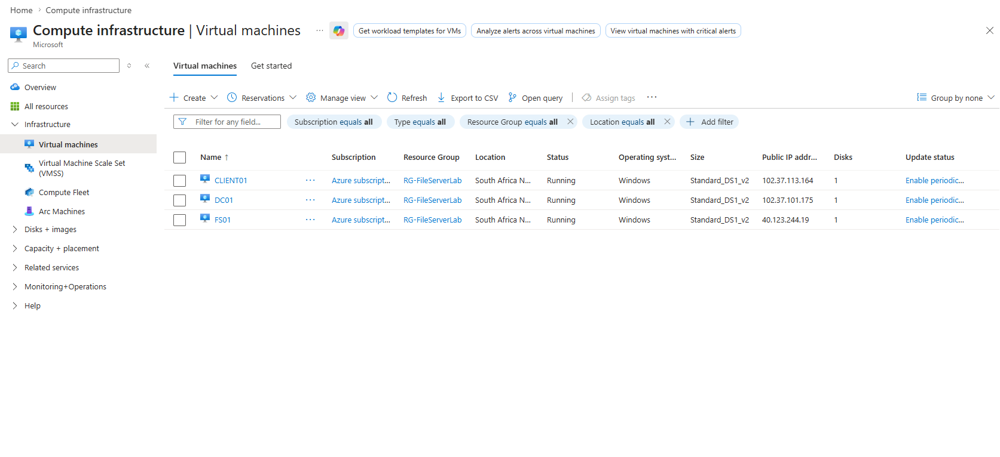
*DC01 and FS01 (Windows Server 2022) and CLIENT01 (Windows 11), all `Standard_DS1_v2`.*

The network security group — the only inbound path is RDP from a single IP, with everything else denied:

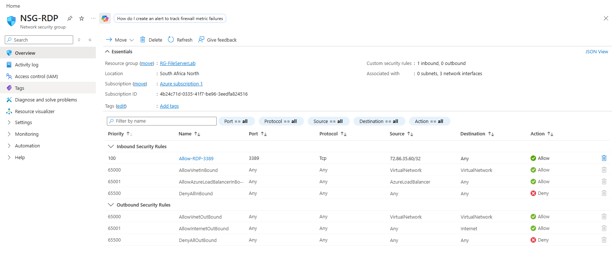
*`Allow-RDP-3389` permits TCP 3389 from `72.86.35.60/32` only; `DenyAllInBound` blocks everything else.*

The admin password is stored in Key Vault, never in a file:

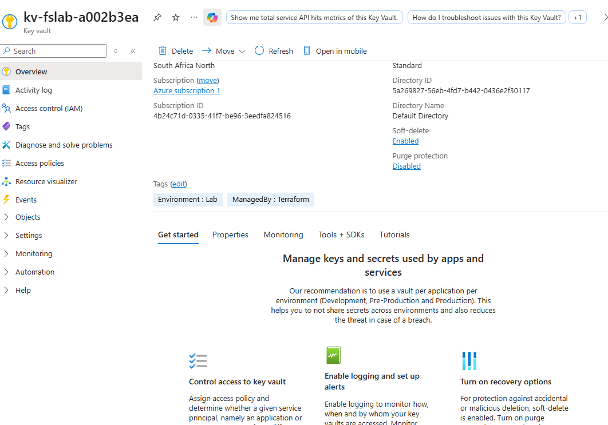
*`kv-fslab-a002b3ea` holds the VM admin secret, tagged and managed by Terraform.*

### Configuration Flow

The infrastructure is provisioned first, then a single orchestration script configures the domain in dependency order, handling the reboots that AD promotion and domain joins require.

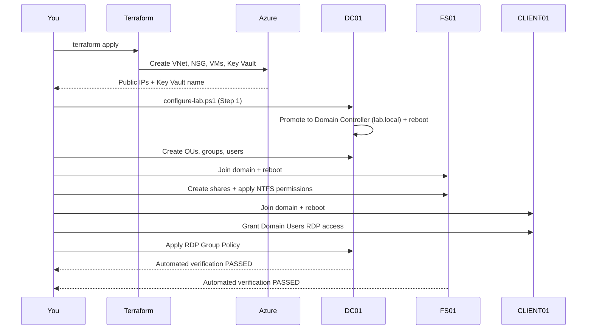
```mermaid
sequenceDiagram
    participant You
    participant TF as Terraform
    participant Azure
    participant DC01
    participant FS01
    participant CLIENT01

    You->>TF: terraform apply
    TF->>Azure: Create VNet, NSG, VMs, Key Vault
    Azure-->>You: Public IPs + Key Vault name

    You->>DC01: configure-lab.ps1 (Step 1)
    DC01->>DC01: Promote to Domain Controller (lab.local) + reboot
    You->>DC01: Create OUs, groups, users
    You->>FS01: Join domain + reboot
    You->>FS01: Create shares + apply NTFS permissions
    You->>CLIENT01: Join domain + reboot
    You->>CLIENT01: Grant Domain Users RDP access
    You->>DC01: Apply RDP Group Policy
    DC01-->>You: Automated verification PASSED
    FS01-->>You: Automated verification PASSED
```

---

## The Permission Model

This is the core of the lab. Access is never granted to a user directly — it is granted to a **group**, and users inherit access through membership. This is what makes the model scale: onboarding a new Finance hire is one group-add, with zero changes on the file server.

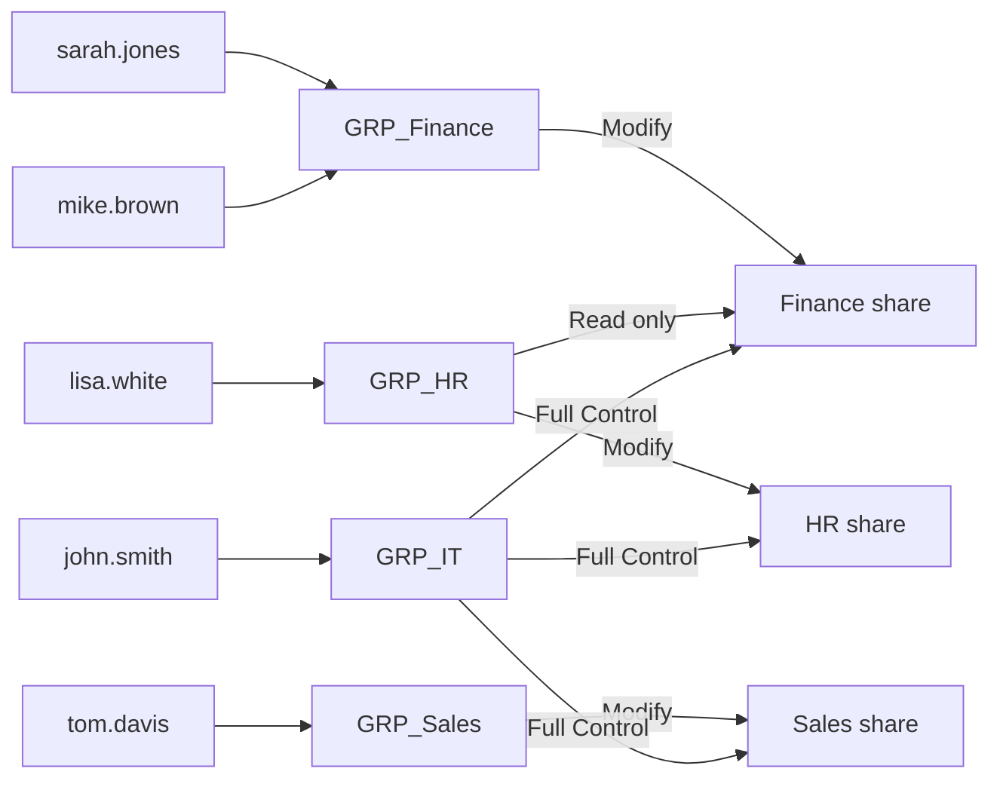
```mermaid
graph LR
    U1["sarah.jones"] --> GF["GRP_Finance"]
    U2["mike.brown"] --> GF
    U3["lisa.white"] --> GH["GRP_HR"]
    U4["tom.davis"] --> GS["GRP_Sales"]
    U5["john.smith"] --> GI["GRP_IT"]

    GF -->|Modify| SF["Finance share"]
    GH -->|Modify| SH["HR share"]
    GH -->|Read only| SF
    GS -->|Modify| SS["Sales share"]
    GI -->|Full Control| SF
    GI -->|Full Control| SH
    GI -->|Full Control| SS
```

### Expected Access Matrix

| User (group) | Finance | HR | Sales | IT |
| --- | --- | --- | --- | --- |
| **sarah.jones** (Finance) | Read / Write | Denied | Denied | Denied |
| **mike.brown** (Finance) | Read / Write | Denied | Denied | Denied |
| **lisa.white** (HR) | **Read only** | Read / Write | Denied | Denied |
| **tom.davis** (Sales) | Denied | Denied | Read / Write | Denied |
| **john.smith** (IT) | Full | Full | Full | Full |

> **The standout case is `lisa.white` on Finance** — she can open and read the files but cannot save changes. That read-but-not-write distinction is NTFS granularity working exactly as intended, and it is the single best demonstration that the model is enforced at the permission level, not just folder visibility.

### How the permissions are applied

On FS01, each folder has inheritance disabled and the default broad groups stripped out, so access is *only* what is explicitly granted:

```powershell
icacls $path /inheritance:d
icacls $path /remove "BUILTIN\Users"
icacls $path /remove "Everyone"
icacls $path /remove "NT AUTHORITY\Authenticated Users"
icacls $path /grant "LAB\GRP_Finance:(OI)(CI)M"   # Modify, inherited by files & subfolders
icacls $path /grant "LAB\GRP_HR:(OI)(CI)R"         # Read only
icacls $path /grant "LAB\GRP_IT:(OI)(CI)F"         # Full Control
```

The SMB share itself is set to `Everyone — Full Control` on purpose. The effective permission is always the **more restrictive** of share-level and NTFS, so enforcement is handled entirely at the NTFS layer — a standard production pattern.

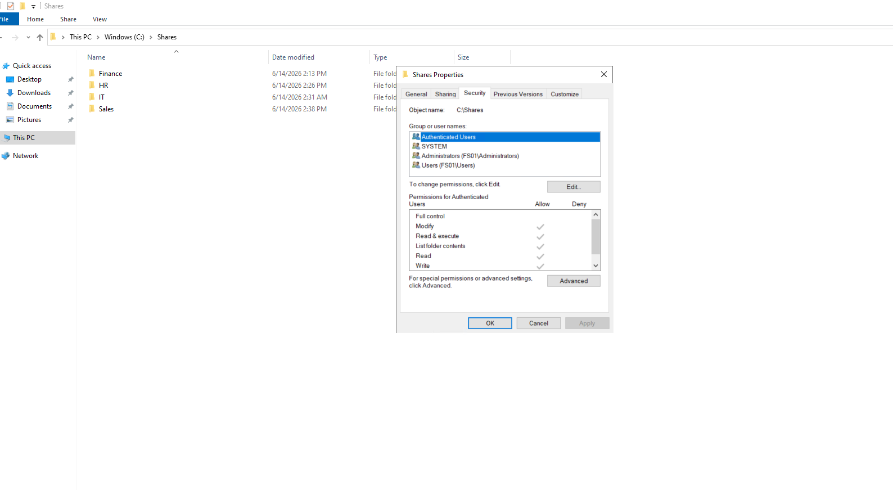
*The four department folders on FS01. Real access control lives in the NTFS ACLs, not the wide-open share permission.*

---

## Technology Used

| Layer | Tool |
| --- | --- |
| Infrastructure as Code | Terraform (`azurerm`, `random`, `time` providers) |
| Cloud platform | Microsoft Azure |
| Configuration | PowerShell via `az vm run-command` |
| Directory services | Active Directory Domain Services, DNS, Group Policy |
| Secrets | Azure Key Vault |
| Operating systems | Windows Server 2022 (DC01, FS01), Windows 11 (CLIENT01) |

---

## Repository Layout

```
ntfs-lab-terraform/
├── backend.tf                 # Remote state in Azure Blob Storage
├── versions.tf                # Provider versions
├── variables.tf               # Input variables (incl. sensitive admin_password)
├── main.tf                    # VNet, subnet, NSG, NICs, public IPs, VMs
├── keyvault.tf                # Key Vault, secret, RBAC role assignment
├── outputs.tf                 # Public IPs + Key Vault name
├── terraform.tfvars.example   # Safe template (committed)
├── terraform.tfvars           # Real values (git-ignored)
├── .gitignore                 # Blocks secrets and state from commits
├── configure-lab.ps1          # Orchestration script (the only script run by hand)
└── scripts/
    ├── 00-promote-dc.ps1                        # DC01 → Domain Controller
    ├── 01-create-ad-users-groups.ps1            # OUs, groups, users
    ├── 02-configure-shares-and-permissions.ps1  # SMB shares + NTFS ACLs
    ├── 03-configure-rdp-gpo.ps1                 # RDP Group Policy
    ├── 04-domain-join.ps1                       # Joins FS01 and CLIENT01
    ├── 05-verify-ad.ps1                         # PASS/FAIL check of AD objects
    ├── 05-verify-shares.ps1                     # PASS/FAIL check of NTFS permissions
    └── 06-add-rdp-users.ps1                     # Domain Users → RDP group on CLIENT01
```

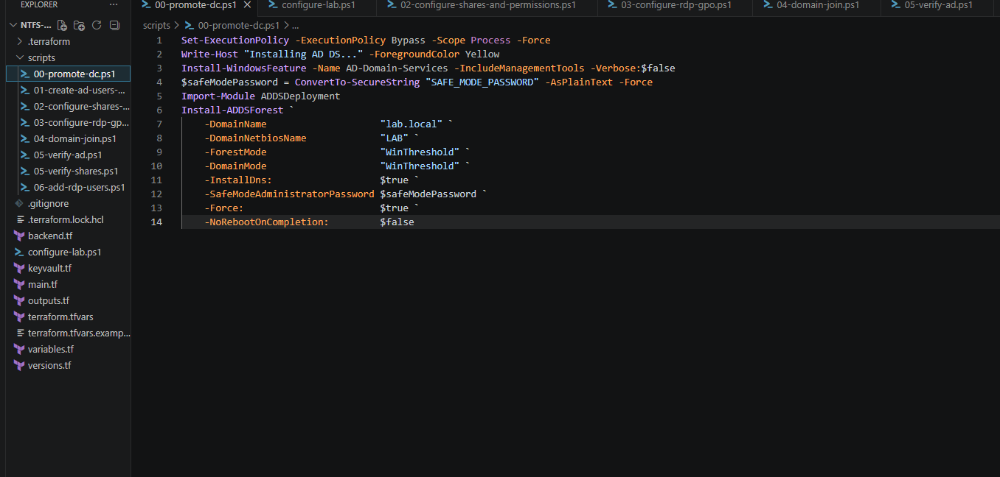
*The Terraform files in the root, the eight PowerShell scripts in `scripts/`, and `configure-lab.ps1` — the only script run by hand.*

---

## Infrastructure as Code

The whole environment is defined in Terraform — nothing is clicked together in the portal, so it can be torn down and rebuilt identically.

**`backend.tf`** — state is stored remotely in Azure Blob Storage, so it is encrypted, backed up, and safe to lose locally:

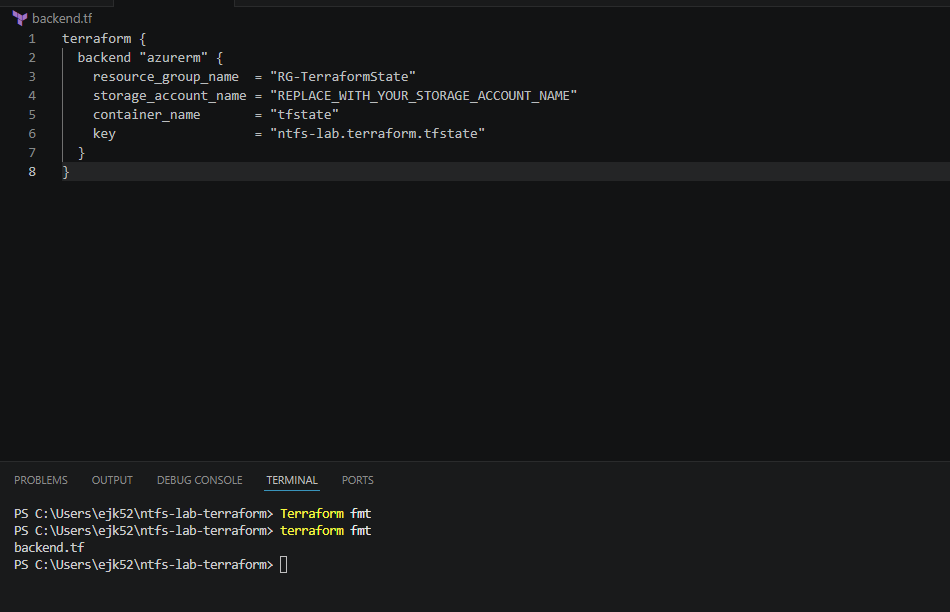

**`versions.tf`** — pins the provider versions the lab depends on:

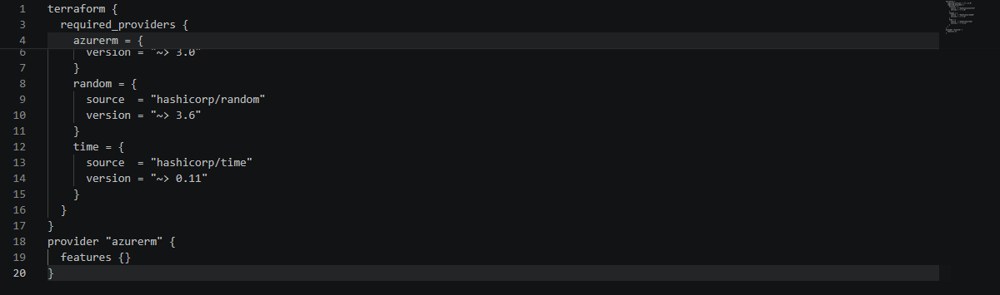

**`variables.tf`** — input variables; note `admin_password` is marked sensitive with no default:

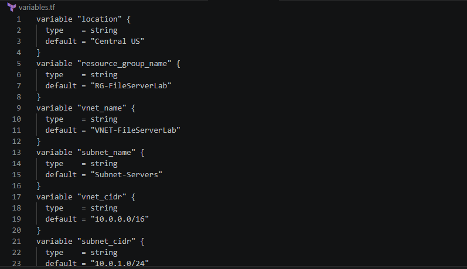

**`main.tf`** — the resource group, network, and (further down) the NSG, NICs, and VMs. Note the `time_sleep` resources that absorb Azure's eventual-consistency delays:

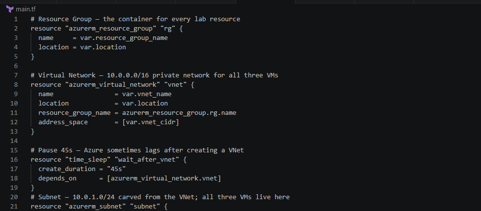

**`keyvault.tf`** — generates a globally-unique vault name, creates the vault with RBAC authorization, and stores the admin secret:

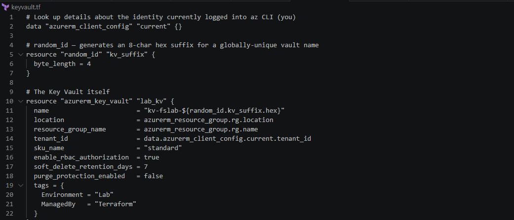

**`outputs.tf`** — surfaces the public IPs and the Key Vault name needed for configuration:

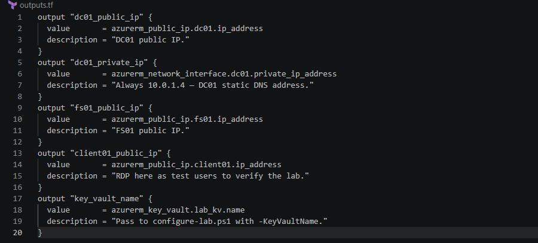

> **Secrets stay out of source control.** `admin_password` has no default and is injected at runtime via the `TF_VAR_admin_password` environment variable; `.gitignore` blocks `terraform.tfvars` and all state files from ever being committed.

---

## Prerequisites

| Requirement | Notes |
| --- | --- |
| Azure subscription | A pay-as-you-go subscription is recommended. Free-tier accounts cap regional CPU cores (often 4) and cannot request quota increases — see [Troubleshooting](#troubleshooting--lessons-learned). |
| Terraform ≥ 1.5.0 | `winget install HashiCorp.Terraform` |
| Azure CLI | `winget install --exact --id Microsoft.AzureCLI` |
| PowerShell 5.1+ | Built into Windows |

Confirm your tooling and the active subscription before starting:

```powershell
terraform -version
az version
az account show
```

---

## How to Deploy

### 1. Create the remote state backend (one time)

```powershell
az group create --name RG-TerraformState --location "<your-region>"
az storage account create --name <globally-unique-name> --resource-group RG-TerraformState --sku Standard_LRS --encryption-services blob
az storage container create --name tfstate --account-name <globally-unique-name>
```

Then set `storage_account_name` in `backend.tf` to the account you created.

### 2. Configure your variables

In `terraform.tfvars`, set your region, your VM size, and your public IP (find it at whatismyip.com) in CIDR form:

```hcl
location       = "<your-region>"
rdp_source     = "<your.public.ip>/32"
server_vm_size = "<size>"
client_vm_size = "<size>"
```

Set the admin password as an environment variable so it never touches a file:

```powershell
$env:TF_VAR_admin_password = "<a-strong-password>"
```

### 3. Deploy

```powershell
terraform init
terraform plan
terraform apply
```

On completion Terraform prints the outputs you need next — the **Key Vault name** and **CLIENT01's public IP**.

---

## How It Is Configured

With the VMs running and `az login` active, run the orchestrator with the Key Vault name from the previous step:

```powershell
.\configure-lab.ps1 -KeyVaultName "<key-vault-name>"
```

This runs unattended for roughly 15–20 minutes. It pulls the admin password from Key Vault, then pushes each script to the correct VM in order, waiting for reboots after the domain-controller promotion and each domain join. It finishes by running both verification scripts.

---

## Verification

The lab is proven on two levels: automated checks built into the configuration, and manual access tests as each user.

### Automated verification

The configuration run ends with scripted PASS/FAIL checks of every AD object and every NTFS permission:

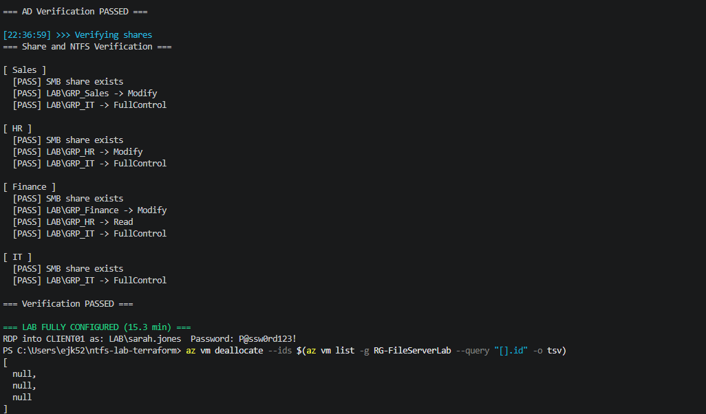
*Both `AD Verification` and `Share and NTFS Verification` return PASSED across all groups, users, shares, and rights.*

### Manual access tests

Logging into CLIENT01 as each test user and attempting to read and write each share confirms the model enforces correctly.

**sarah.jones (Finance)** — writes Finance, denied everywhere else:

| Finance — success | HR — denied |
| --- | --- |
| 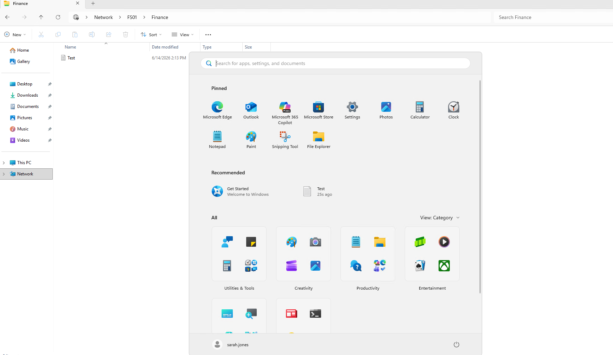 | 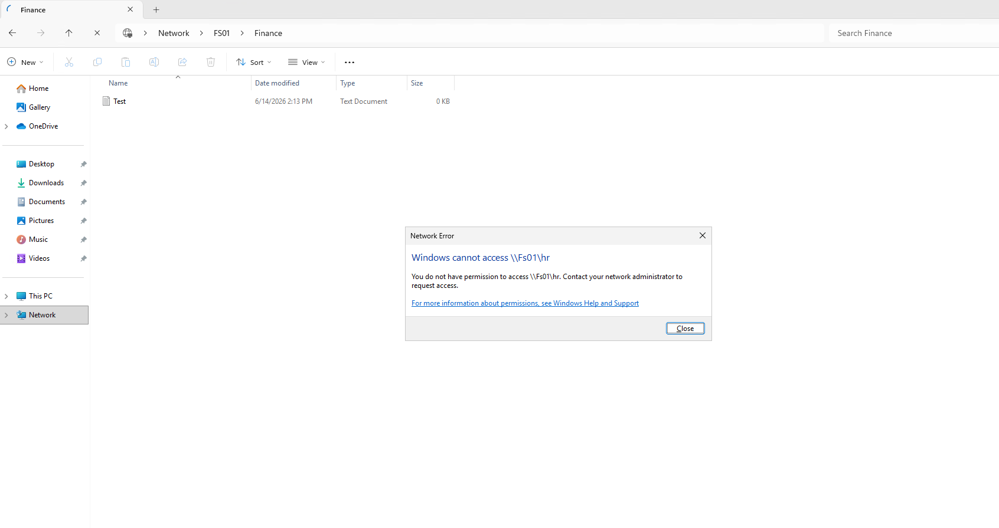 |

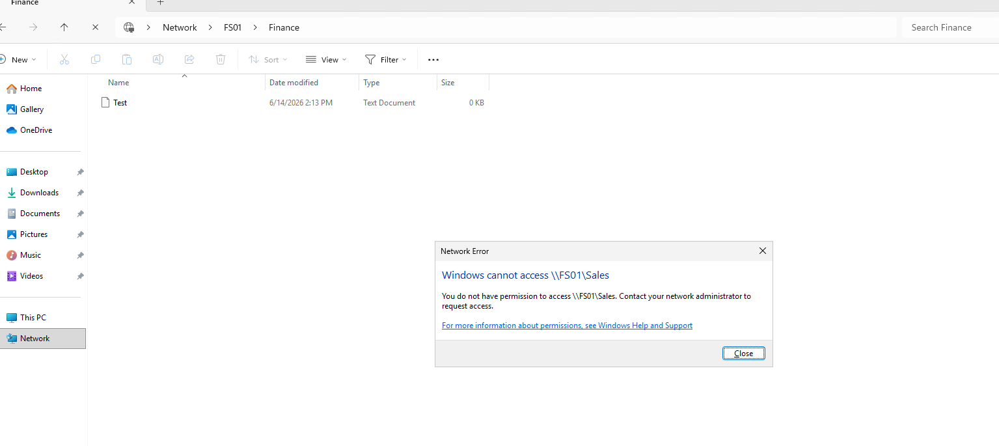
*Also denied on Sales — Sarah only has access to her own department's share.*

**lisa.white (HR)** — writes HR, **reads but cannot write Finance**, denied Sales:

| HR — success | Sales — denied |
| --- | --- |
| 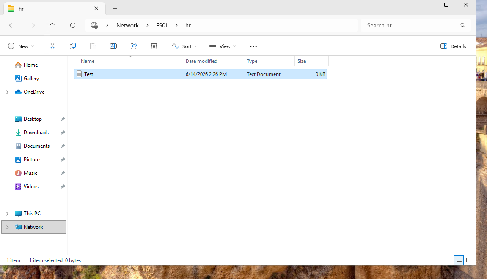 | 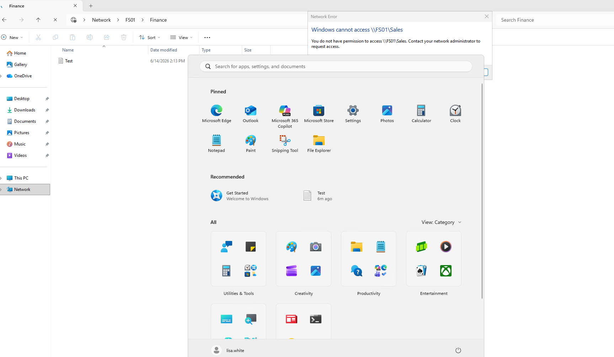 |

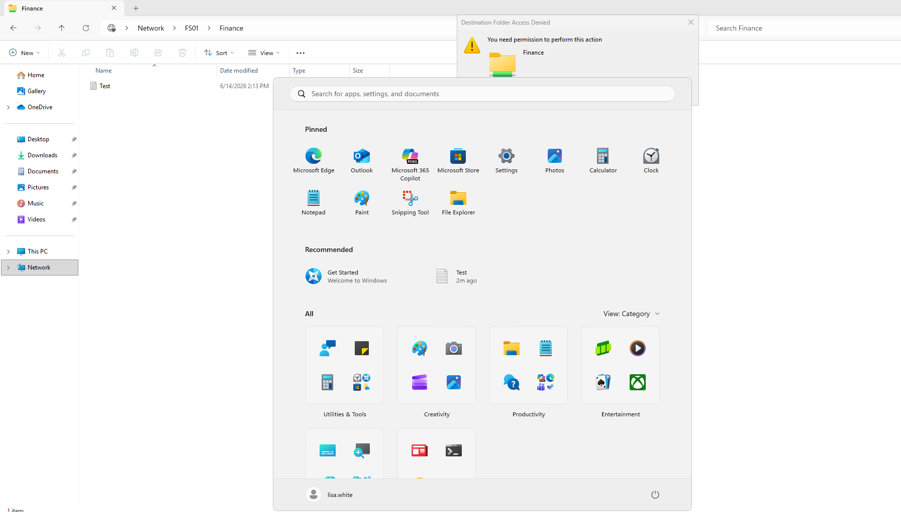
*The standout case: Lisa can open and read Finance, but saving a file returns "Destination Folder Access Denied" — Read without Write, exactly as designed.*

**tom.davis (Sales)** — writes Sales, denied Finance and HR:

| Sales — success | Finance — denied |
| --- | --- |
| 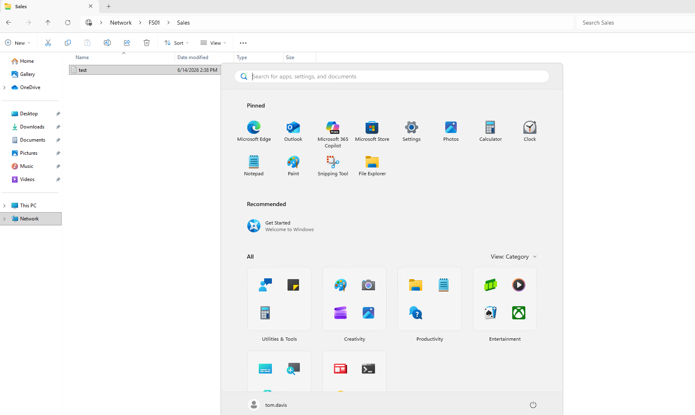 | 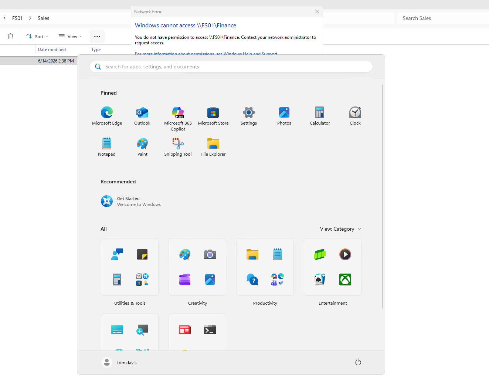 |

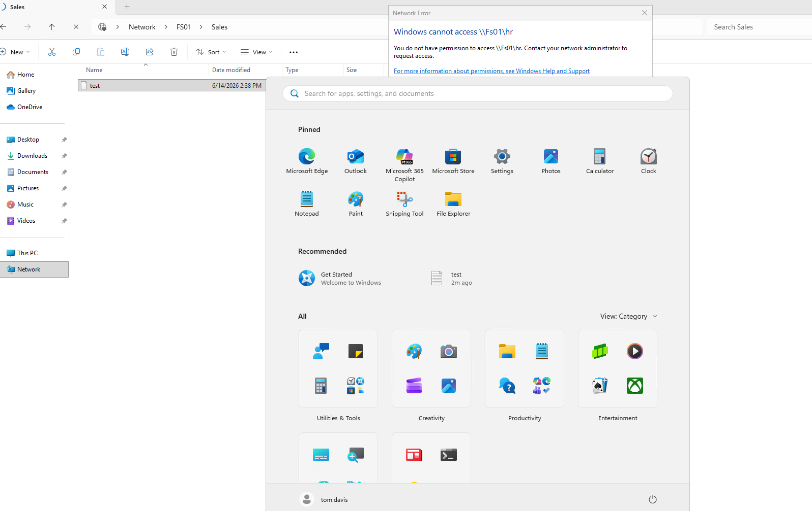
*Also denied on HR — Tom's access is limited to Sales.*

Every result matches the [access matrix](#expected-access-matrix), confirming the user → group → NTFS permission chain enforces the business rules correctly.

---

## Cost Management & Teardown

The VMs accrue compute charges while running. To stop charges without losing the environment:

```powershell
az vm deallocate --ids $(az vm list -g RG-FileServerLab --query "[].id" -o tsv)
```

To bring it back:

```powershell
az vm start --ids $(az vm list -g RG-FileServerLab --query "[].id" -o tsv)
```

> Note: CLIENT01 and FS01 use dynamic public IPs and may receive new addresses after a deallocate/start cycle. Re-check before reconnecting:
> ```powershell
> az vm list -g RG-FileServerLab -d --query "[].{Name:name, IP:publicIps}" -o table
> ```

To remove everything permanently (keep `RG-TerraformState`):

```powershell
terraform destroy
```

---

## Troubleshooting & Lessons Learned

The first deployment did not succeed on the first try, and that turned out to be the most valuable part of the project. Each issue below is a real-world condition a cloud or systems administrator routinely encounters.

| Problem encountered | Root cause | Resolution |
| --- | --- | --- |
| `SkuNotAvailable` on VM creation | The chosen VM size was not available in the selected region for this subscription | Queried real availability with `az vm list-skus` instead of assuming, then selected an available size and region |
| `PlatformImageNotFound` for Windows 11 | The image SKU had been retired | Listed current SKUs with `az vm image list` and selected a published version |
| `OperationNotAllowed` — regional cores quota | Free-tier subscription capped at 4 cores; three 2-core VMs require 6 | Right-sized the VMs to a 1-core SKU (`Standard_DS1_v2`) to fit the constraint rather than fighting it |
| `Root object was present, but now absent` | Transient Azure provider/consistency timing during VNet creation | Re-ran `apply`; resolved on a clean run |
| `PrivateIPAddressIsAllocated` on DC01 | A race condition: a dynamically-addressed NIC claimed `10.0.1.4` before the domain controller could take its static address | Fixed at the source with an explicit `depends_on` so DC01's NIC is created first and reserves the address |
| Key Vault secret `already exists` | Soft-deleted Key Vault was recovered on rebuild, carrying the old secret | Permanently cleared it with `az keyvault purge`, then redeployed clean |
| State drift after partial failures | Resources existed in Azure but not in Terraform state (and vice versa) | Reconciled with `terraform apply -refresh-only` and `terraform import` |

**Takeaway:** the goal was never a deployment that happened to work first try. The valuable skill is reading the error, diagnosing the true cause, and resolving it cleanly — and fixing root causes (the `depends_on` race condition) rather than repeatedly working around symptoms.

---

## Skills Demonstrated

- **Infrastructure as Code** — modular Terraform, remote state, provider version pinning, dependency management
- **Azure administration** — VNets, NSGs, VM provisioning, Key Vault, quota and SKU management
- **Active Directory** — domain controller promotion, OUs, security groups, Group Policy, DNS
- **Windows file services** — SMB shares, NTFS ACLs, inheritance, the share-vs-NTFS effective-permission model
- **Secrets management** — runtime injection, Key Vault storage, keeping credentials out of source control
- **Automation** — agent-based remote configuration that respects a locked-down firewall
- **Troubleshooting** — diagnosing capacity, quota, image, state-drift, and race-condition failures under real conditions

---

*Lab 1 of a series. The same FS01 environment is reused in Lab 2 (RBAC), which is why teardown uses deallocation rather than destruction between labs.*
